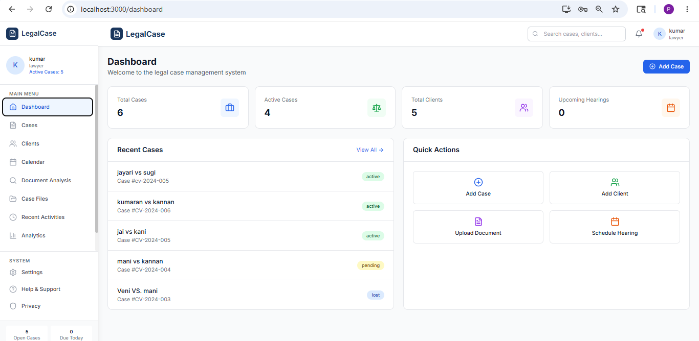
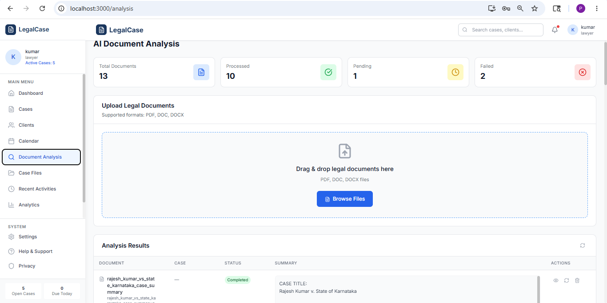
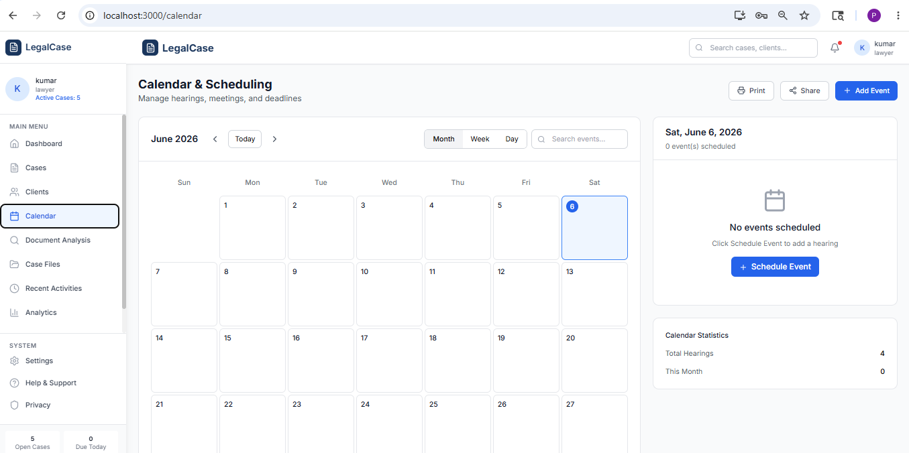
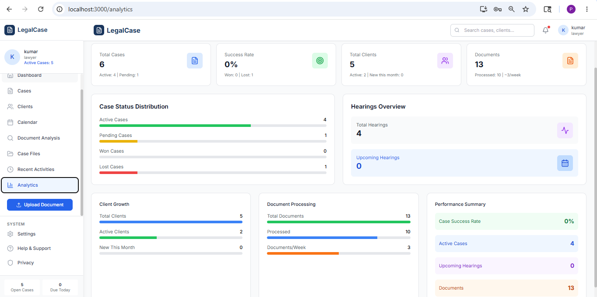
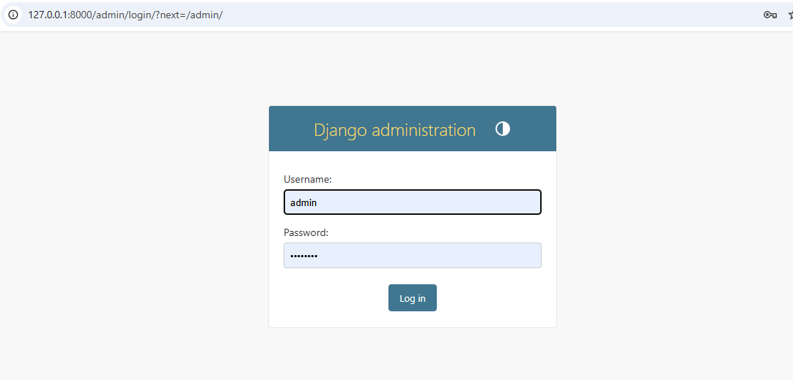

# Legal Case Management System

## 📌 About
A web application for lawyers to manage cases, clients, legal documents with AI summarization, and automatic email reminders for court hearings.

## 🚀 Features

- **Case Management** - Add, edit, delete, track cases
- **Client Management** - Manage client information
- **Document Analysis** - Upload PDFs, AI generates case summary
- **Calendar** - Schedule hearings with date/time
- **Email Reminders** - Automatic emails 2 hours before hearing
- **Dashboard** - Real-time statistics and analytics

## 📷 Screenshots

### Dashboard

### Document Analysis with AI Summary

### Calendar & Hearings

### Analytics Dashboard

### Admin Backend

### Dashboard Backend
!dashboard](dashboardbackend.png)

## 🛠️ Tech Stack

| Layer | Technology |
|-------|------------|
| Frontend | React, TypeScript, Tailwind CSS |
| Backend | Django, Django REST Framework |
| AI | Google Gemini API |
| Database | SQLite |

## 👨‍💻 Author
**Jayasri**

## ⭐ Star this repo if you like it!
